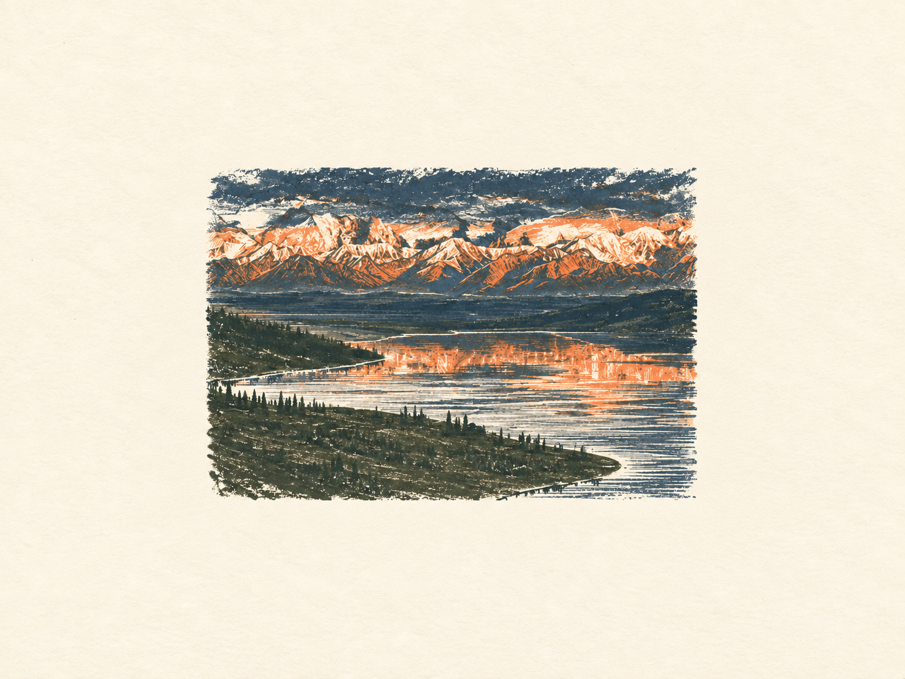
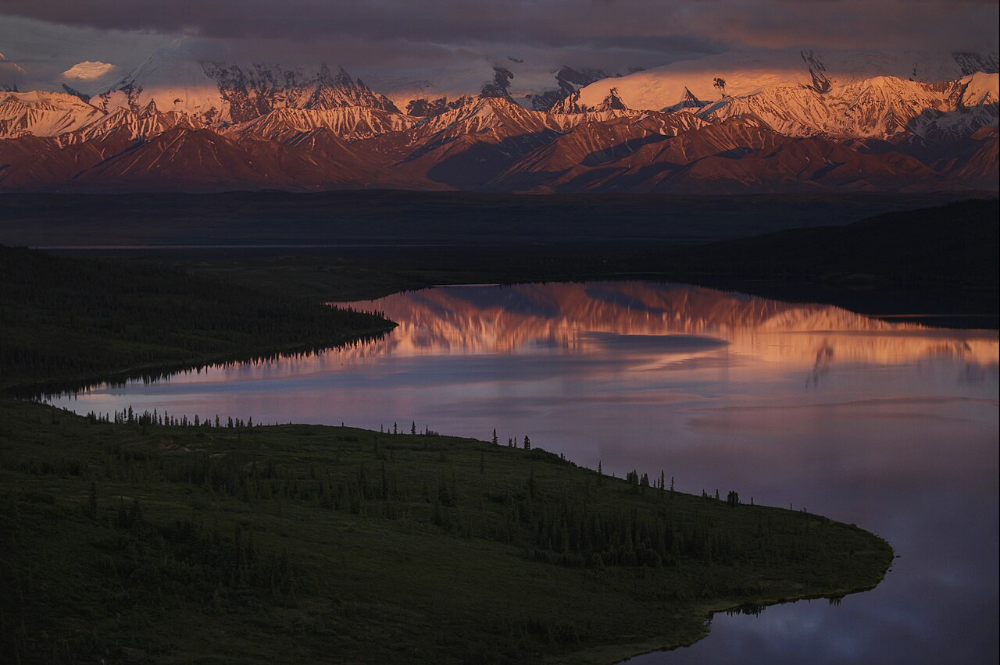
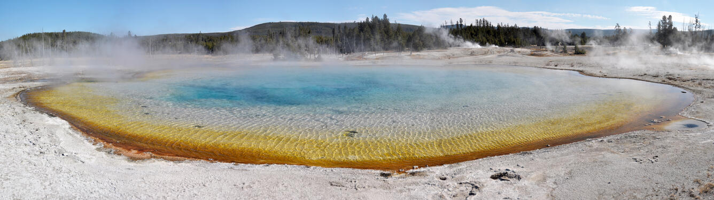
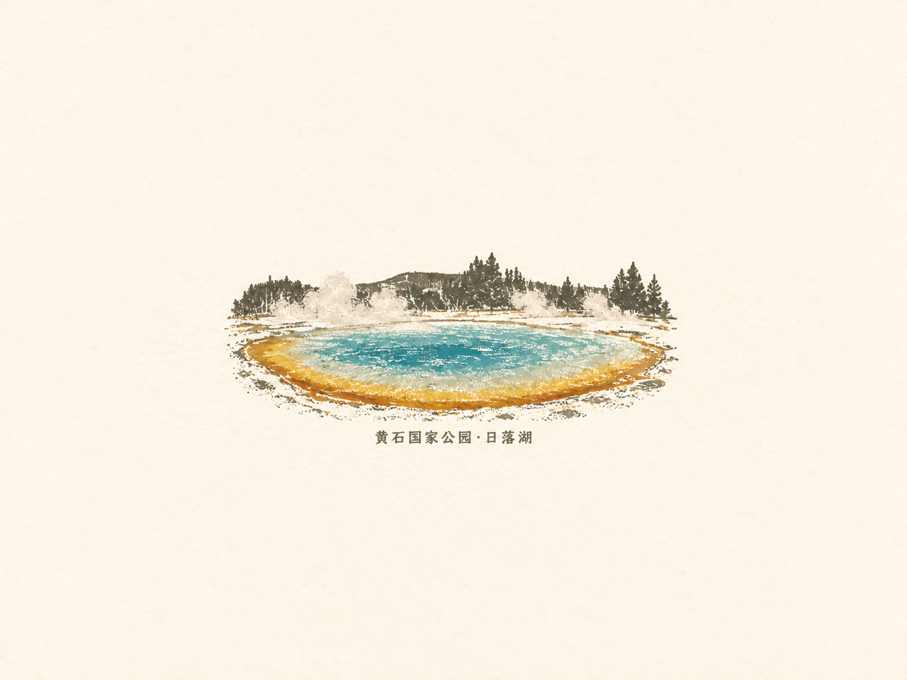

# 照片转复古套色版画

**把风景的光色与空间关系，留在一小幅有墨迹触感的插画里。**

一个可移植的 Agent Skill：大面积留白、有限套色、粗颗粒墨层、简练形体。支持按可靠地点信息添加文字标签。



## 转换效果

### 雪山与湖面 · 保留照片想表达的光色

| 风景原照 | 技能转换示例 |
| --- | --- |
|  |  |

画面的表达中心是山巅暖光与冷色湖面的呼应。转换时保留山形、倒影和冷暖关系，将树林、岩石与水纹归并为少量色块，避免逐项复刻照片细节。

### 地热湖泊 · 加上朴素的地点标签

| 风景原照 | 带文字的转换示例 |
| --- | --- |
|  |  |

保留蓝绿色水面、赭色池缘、蒸汽和林带的关系。标签使用来源页面确认的地点「黄石国家公园·日落湖」，只标地点，不添加宣传语或诗意标题。

示例原照均为公共领域的无人风景照，插画为 AI 转换示例。素材来源与许可见 [素材说明](assets/SOURCES.md)。

## 风格规则

| 要素 | 具体要求 |
| --- | --- |
| 照片主旨 | 先判断照片表达的景物关系与氛围；重要的晚霞、雾气、水面和倒影应完整保留。 |
| 留白 | 默认 4:3 横版纸面。绘画与标签一起缩放、居中，联合外沿限定在下图区域内。 |
| 细节 | 以轮廓、主要转折与少量结构线交代景物，实质删减重复纹理。 |
| 颗粒 | 墨层内部有粗细混合颗粒、中等缺墨斑簇与方向性干擦，正常观看即可辨认。 |
| 纸色与套色 | 干净的浅米白纸底，通常采用 2—3 种柔和墨色；颜色面积服从照片主旨。 |
| 人物 | 全部改为背影或完全看不到脸的侧后方，整体转向自然；禁止用肤色色块、面具或模糊替代。 |
| 文字 | 默认无字；按要求添加能核实到的最具体地点，不猜测、不擅自加标题。 |


占位比例是生成约束，成图仍需检查实际边缘。重要天光通过缩小整组画面得到保留；外部留白与场景内部天空分别处理。

## 安装

下载本仓库，将文件夹命名为 `photo-to-vintage-print`，放入所用 Agent 的技能目录。至少保留 `SKILL.md` 与 `references/`；其余文件可随完整目录一起安装。

| 环境 | 安装位置 |
| --- | --- |
| Codex 本地环境 | `~/.agents/skills/photo-to-vintage-print/` |
| Claude Code 本地环境 | `~/.claude/skills/photo-to-vintage-print/` |
| 其他支持 Agent Skills 的环境 | 放入该环境的技能目录，保持相对路径结构。 |

上述目录依据 [Codex 技能说明](https://learn.chatgpt.com/docs/build-skills) 与 [Claude Code 技能说明](https://code.claude.com/docs/en/skills)。两个本地环境均支持技能目录的符号链接，可让它们共用一份文件。Cowork、云端 Agent 等环境按各自的技能导入方式安装，本地目录不会自动同步到云端。

不支持技能发现的 Agent 也可以读取 `SKILL.md`，并按需读取 `references/prompt-template.md`。这只提供规则；实际生成图片还需要该 Agent 具备参考图编辑或图像重绘能力。不同工具的成图效果会有差异。

## 怎么用

安装后附上原照，在支持显式技能调用的环境中选择本技能，或直接说明要使用这套风格。

**普通版本**

> 用 photo-to-vintage-print 把这张照片转为复古套色版画，不加文字。

**带地点标签**

> 用 photo-to-vintage-print 转换这张照片，添加核实后的地点文字。优先读取原图定位；不能确定时先问我。

**已经知道地点**

> 用 photo-to-vintage-print 转换这张照片，标签写「黄石国家公园·日落湖」。

**只修改一个方面**

> 保持已认可的构图和留白，只增强墨层内部的粗颗粒与缺墨感。

Codex 可显式使用 `$photo-to-vintage-print`；Claude Code 可使用 `/photo-to-vintage-print`。其他环境按自身调用方式使用。

## 地点与数据

地点标签需要可靠依据，可以来自用户提供的信息、原照元数据或可信的地名资料。GPS 通常代表拍摄位置，远处景物不能直接使用最近地图标记命名。没有定位时可以提供原文件或告知地点。

本仓库仅包含规则、通用模板和展示素材，没有执行脚本、联网服务、账户配置或密钥。实际图像处理由所用 Agent 及其图像工具完成；照片及定位信息如何传输和处理，取决于该运行环境。

## 文件结构

```text
photo-to-vintage-print/
├── SKILL.md                      # 完整风格与执行规则
├── references/prompt-template.md # 可复用的提示词模板
├── agents/openai.yaml            # 可选的界面显示信息
├── assets/                       # README 风景示例与占位图
├── README.md
└── LICENSE
```

## 许可

技能规则、模板、文档与布局示意图采用 [MIT License](LICENSE)。原始风景照片的公共领域说明，以及 AI 插画示例的使用范围见 [素材说明](assets/SOURCES.md)。展示素材不代表来源机构认可或推荐本项目。
